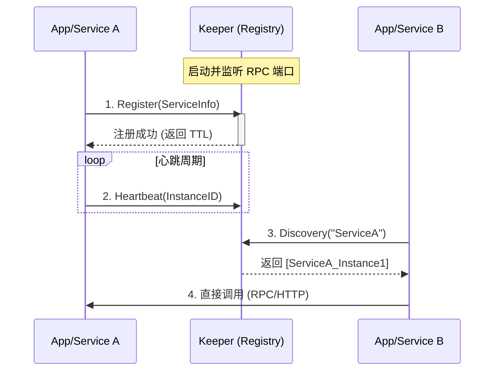

# Keeper 注册中心功能技术设计文档

## 1. 概述
在微服务架构或分布式应用中，服务注册与发现是核心组件。Keeper 目前作为守护进程管理器，已具备管理子进程和 RPC 通信的能力。本设计旨在为 Keeper 扩展**轻量级注册中心**功能，使其能够管理服务实例的生命周期，并为服务间调用提供地址发现能力。

## 2. 核心功能
1.  **服务注册 (Registration)**: 服务启动时向 Keeper 注册自身信息（名称、地址、端口、元数据等）。
2.  **服务发现 (Discovery)**: 服务消费者向 Keeper 查询特定服务名称的可用实例列表。
3.  **健康检查 (Health Check)**: 基于心跳 (Heartbeat) 机制，自动剔除不健康或宕机的服务实例。
4.  **服务注销 (Deregistration)**: 服务关闭时主动从 Keeper 移除自身信息。

## 3. 架构设计

Keeper 作为 **Registry Server**，运行在独立进程中。
App (Keeper 管理的子进程) 或外部服务作为 **Registry Client**。



## 4. 数据模型

### 4.1 ServiceInstance (服务实例)
```go
type ServiceInstance struct {
    ID          string            `json:"id"`           // 唯一实例ID (UUID 或 host:port)
    Name        string            `json:"name"`         // 服务名称 (如 "order-service")
    Host        string            `json:"host"`         // IP地址
    Port        int               `json:"port"`         // 端口号
    Tags        []string          `json:"tags"`         // 标签 (如 "v1", "prod")
    Metadata    map[string]string `json:"metadata"`     // 元数据
    Weight      int               `json:"weight"`       // 权重
    Status      int               `json:"status"`       // 状态 (1:UP, 0:DOWN)
    LastUpdated int64             `json:"last_updated"` // 最后心跳时间戳
}
```

### 4.2 Registry Store (存储结构)
使用内存结构存储，保证高性能读写。
```go
// map[ServiceName]map[InstanceID]*ServiceInstance
type RegistryStore struct {
    services map[string]map[string]*ServiceInstance
    mu       sync.RWMutex
}
```

## 5. 接口设计 (RPC)

基于现有的 `sloth` RPC 框架，定义 `RegistryService`。

### 5.1 Register
*   **Method**: `registry.Register`
*   **Args**: `RegisterRequest` (包含 `ServiceInstance`)
*   **Return**: `RegisterResponse` (包含 `TTL` 心跳间隔)
*   **逻辑**: 将实例信息写入内存，如果已存在则更新。

### 5.2 Deregister
*   **Method**: `registry.Deregister`
*   **Args**: `DeregisterRequest` (包含 `ServiceName`, `InstanceID`)
*   **Return**: `error`
*   **逻辑**: 从内存中移除指定实例。

### 5.3 Heartbeat
*   **Method**: `registry.Heartbeat`
*   **Args**: `HeartbeatRequest` (包含 `ServiceName`, `InstanceID`)
*   **Return**: `error`
*   **逻辑**: 更新实例的 `LastUpdated` 时间戳。如果实例不存在，返回错误要求重新注册。

### 5.4 Discovery
*   **Method**: `registry.Discovery`
*   **Args**: `DiscoveryRequest` (包含 `ServiceName`, `Tags`可选)
*   **Return**: `DiscoveryResponse` (包含 `[]ServiceInstance`)
*   **逻辑**: 返回指定服务名称下的所有健康 (`UP`) 实例。

## 6. 核心机制实现

### 6.1 过期剔除 (Eviction)
Keeper 启动一个后台 Goroutine，定期（如每 10 秒）扫描所有服务实例。
*   如果 `CurrentTime - LastUpdated > TTL * 3`，则认为该实例失效，从注册表中移除。

### 6.2 客户端重试
客户端需实现简单的重试逻辑：
*   注册失败时，指数退避重试。
*   心跳发送失败时，尝试重新注册。

## 7. 持久化 (可选/进阶)
为了防止 Keeper 重启后注册信息丢失，可实现简单的文件持久化。
*   **快照 (Snapshot)**: 定期（如每分钟）将内存中的 `RegistryStore` 序列化为 JSON 写入磁盘 `registry_snapshot.json`。
*   **恢复 (Recovery)**: Keeper 启动时读取快照文件恢复数据。

## 8. 开发计划
1.  **Phase 1**: 定义 `ServiceInstance` 结构体与 RPC 接口参数。
2.  **Phase 2**: 实现 `RegistryService` 核心逻辑（注册、注销、发现）。
3.  **Phase 3**: 实现心跳检测与过期剔除机制。
4.  **Phase 4**: 在 `keeper app` 中集成客户端 SDK，进行联调测试。
